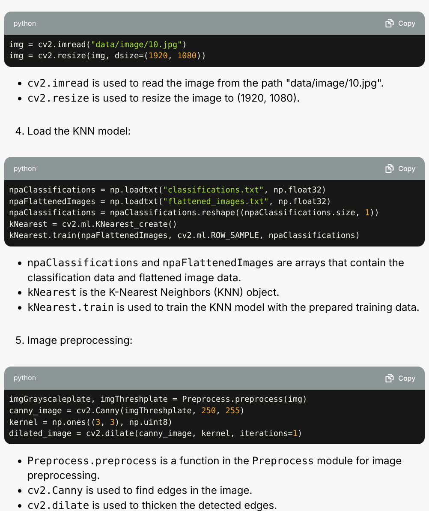

1. Import necessary libraries:

```bash
  import math
  import cv2
  import numpy as np
  import Preprocess
```
In this section, the required libraries are imported.
  math is used for calculating the rotation angle of the license plate.
  cv2 is the OpenCV library for image and video processing.
  numpy is a library for multidimensional array operations.
  Preprocess is a custom module that contains image preprocessing functions.

2. Declare constants:
```python
ADAPTIVE_THRESH_BLOCK_SIZE = 19
ADAPTIVE_THRESH_WEIGHT = 9
n = 1
Min_char = 0.01
Max_char = 0.09
RESIZED_IMAGE_WIDTH = 20
RESIZED_IMAGE_HEIGHT = 30
```
  ADAPTIVE_THRESH_BLOCK_SIZE and ADAPTIVE_THRESH_WEIGHT are parameters used for image thresholding.
  n is a counter variable used to label license plates in the image.
  Min_char and Max_char are thresholds used to filter out characters in the license plate based on their area.
  RESIZED_IMAGE_WIDTH and RESIZED_IMAGE_HEIGHT are the dimensions to which the image is resized for character recognition.

3. Read and resize the image:



### Flask Starter Web Development

- You should have Python Environment before install flask-starter app
  - python3
  - virtualenv
  - pip3

> Mac OS

```bash
brew install python3
pip3 install virtualenv
```

> Ubuntu

```bash
sudo apt-get install -y python3 python3-pip python3-virtualenv
```

- Checkout Project

```bash
cd ~/your/path
git clone git@github.com:kienphan/flask-starter.git
```

- Go to inside Project and install

```bash
cd ~/your/path/flask-starter
virtualenv venv
cp .env.example .env
source .env
```

- Install Flask

```bash
pip3 install flask
```

- Execute `run.py` to run

```bash
$ python3 run.py

* Running on http://127.0.0.1:5000/ (Press CTRL+C to quit)
* Restarting with stat
* Debugger is active!
* Debugger PIN: 118-513-369
```